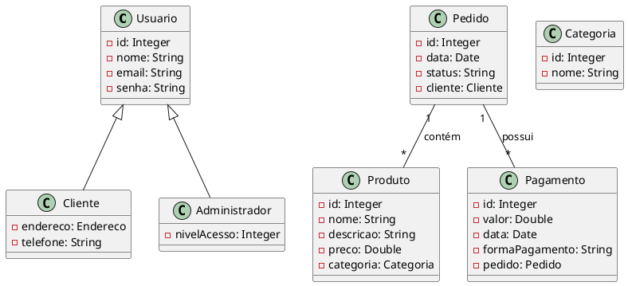

# Prototype

## Gabriel Moreira Bispo Santos (20221TADSSAJ0020)
[@GabrielMreira](https://github.com/GabrielMreira)

<!-- @include: ../../../includes/seminario-1-GabrielMreira/README.md -->

## Pedro Carlos de Gois Barros Santos (20221TADSSAJ0006)
[@Redror](https://github.com/Redror)

<!-- @include: ../../../includes/seminario-1-Redror/README.md -->

## Árlei Nóbrega 

